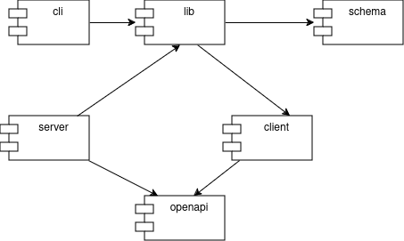

# CDOC2 reference implementation (Java)

[CDOC2](https://open-eid.github.io/CDOC2/) reference implementation (Java)

CDOC stands for 'Crypto Digidoc', encrypted file transmission format used in the [Estonian eID](https://github.com/open-eid) ecosystem

CDOC2 is a new version of [CDOC](https://www.id.ee/wp-content/uploads/2020/06/sk-cdoc-1.0-20120625_en.pdf) (CDOC lib [cdoc4j](https://github.com/open-eid/cdoc4j)), featuring additional security 
measures with optional server backend. CDOC version are not compatible. 

Additional background info can be found in [RIA CDOC2 presentation](https://www.youtube.com/watch?v=otrO2A6TuGQ) 
and [id.ee CDOC 2.0 article](https://www.id.ee/artikkel/cdoc-2-0/)

End-user software to create/decrypt CDOC2: https://github.com/open-eid/DigiDoc4-Client

## Implemented scenarios

**Warning**: Following scenario descriptions are simplification to give general idea, details and **final truth is in
[CDOC2 specification](https://open-eid.github.io/CDOC2/)**.

### CDOC2 ECDH scenario

1. Sender downloads recipient's certificate from SK LDAP using recipient id (isikukood). Recipient certificate contains
   EC public key.
2. Sender generates EC (elliptic curve) key pair using the same EC curve as in recipient EC public key [^1]
3. Sender derives key encryption key (KEK) using ECDH (from sender EC private key and recipient EC public key)  
4. Sender generates file master key (FMK) using HKDF extract algorithm
5. Sender derives content encryption key (CEK) and hmac key (HHK) from FMK using HKDF expand algorithm
6. Sender encrypts FMK with KEK (xor)
7. Sender adds encrypted FMK with senders and recipients public keys to CDoc header[^2]
8. Sender calculates header hmac using hmac key (HHK) and adds calculated hmac to CDoc
9. Sender encrypts content[^3] with CEK (ChaCha20-Poly1305 with AAD)
10. Sender sends CDoc to Recipient 
11. Recipient finds recipients public key from CDoc
12. Recipient derives key encryption key (KEK) using ECDH (from recipient private key on id-kaart and sender public key)
    and decrypts FMK
13. Recipient derives CEK and HHK from FMK using HKDF algorithm
14. Recipient calculates hmac and checks it against hmac in CDoc 
15. Recipient decrypts content using CEK

[^1]: Current specification defines only SecP384R1 Elliptic Curve for key agreement, but in future other EC curves or algorithms can be added, see flatbuffers schemas in cdoc2-schema

[^2]: Header structure is defined in flatbuffers schema, see cdoc2-schema

[^3]: Content is zlib compressed tar archive

### CDOC2 ECDH server scenario

1. *Follow steps from previous scenario 1-6*
2. Sender chooses key transaction server (preconfigured list)
3. Sender sends sender public key and recipient public key to the key transfer server [^4]
4. Server stores public keys in server and generates transaction id
5. Sender adds key server id, recipient public key, transaction id and encrypted FMK to CDoc header
6. *Follow steps from previous scenario 8-10*
7. Recipient finds transaction id  and server using his id-kaart public key from CDoc
8. Recipient authenticates himself against key transfer server using certificate on id-kaart (mutual TLS)
9. Recipient queries the server with transaction id [^4]
10. If recipient certificate public key and recipient public key in transaction record match, then server answers with sender public key
11. *Follow steps from previous steps 12-15*


Key transfer server benefits:
* After the key has been deleted from the key transfer server, the document cannot be decrypted even when keys on recipient's id-kaart have been compromised.
* Other scenarios can be implemented like expiring CDoc2 documents by deleting expired keys from key transfer server. 

[^4]: key transfer server protocol is defined in cdoc2-openapi module

### CDOC2 RSA-OAEP

RSA-OAEP is similar to ECDH scenario, with difference that KEK is generated from secure random (not ECDH) and
KEK is encrypted with recipient RSA public key and included into CDOC header (instead of
sender public key).

1. Sender acquires recipient's certificate from SK LDAP using recipient id or by some other means.
   Recipient certificate contains recipient RSA public key.
2. Sender generates file master key (FMK) using HKDF extract algorithm.
3. Sender generates encryption key (KEK) using secure random.
4. Sender derives content encryption key (CEK) and hmac key (HHK) from FMK using HKDF expand algorithm.
5. Sender encrypts FMK with KEK (xor).
6. Sender encrypts KEK with recipient's RSA public key.
7. Sender adds encrypted FMK and encrypted KEK with recipient's public key to CDoc header.
8. Sender calculates header hmac using hmac key (HHK) and adds calculated hmac to CDoc.
9. Sender encrypts content with CEK (ChaCha20-Poly1305 with AAD).
10. Sender sends CDoc to recipient.
11. Recipient searches CDoc header for recipient's record that contains his public key.
12. Recipient decrypts key encryption key (KEK) using recipient's RSA private key.
13. Recipient decrypts FMK using KEK.
14. Recipient derives CEK and HHK from FMK using HKDF algorithm.
15. Recipient calculates hmac and checks it against hmac in CDoc.
16. Recipient decrypts content using CEK.

### CDOC2 RSA-OAEP with server scenario

1. *Follow steps from RSA-OAEP scenario 1-6*
2. Sender chooses key capsule server (by providing server configuration)
3. Sender sends recipient public key and encrypted KEK inside capsule to the key capsule server
4. Server stores capsule containing recipient public key and encrypted KEK and responds with generated transaction id
5. Sender adds key server id, recipient public key, transaction id and encrypted FMK to CDoc header
6. *Follow steps from RSA-OAEP scenario 8-10*
7. Recipient finds transaction id and server using his public RSA key from CDoc
8. Recipient authenticates against server using RSA certificate (mutual TLS)
9. Recipient queries the server with transaction id [^4]
10. If recipient certificate public key and recipient public key in capsule record match, then server answers with
    capsule that contains encrypted KEK
11. *Follow steps from RSA-OAEP scenario steps 12-15*

### CDOC2 with symmetric key from secret

Similar to ECDH scenario, but KEK is derived from symmetric key (secret) identified by key_label using HKDF algorithm.

1. Sender and recipient have a pre shared secret identified by key_label 
2. Sender derives key encryption key (KEK) from symmetric key, key_label and salt (generated 
   using secure random) using HKDF algorithm
3. *Follow steps from ECDH scenario 4-6*
4. Sender adds encrypted FMK with key_label to CDoc header
5. *Follow steps from ECDH scenario 8-10*
6. Recipient searches CDoc header for key_label and finds salt and encrypted FMK
7. Recipient derives encryption key (KEK) from salt, key_label and pre-shared symmetric key (secret)
8. Recipient decrypts FMK using KEK.
9. *Follow steps from ECDH scenario 13-15*

cdoc2-java-ref-impl does not provide solution for securely storing the secret, but most password managers
 can do that.

### CDOC2 with symmetric key from password

Similar to Symmetric Key scenario, but symmetric key is derived from password and salt using PBKDF2 algorithm.

1. Sender and recipient have a pre shared password identified by key_label
2. Symmetric key is created from password and salt (generated using secure random) using PBKDF2 algorithm
3. Sender derives key encryption key (KEK) from symmetric key and previously generated salt using HKDF algorithm
4. *Follow steps from ECDH scenario 4-6*
5. Sender adds encrypted FMK with key_label to CDoc header
6. *Follow steps from ECDH scenario 8-10*
7. Recipient searches CDoc header for key_label and finds salt and encrypted FMK
8. Recipient derives encryption key (KEK) from salt, key_label and pre-shared symmetric key (password)
9. Recipient decrypts FMK using KEK.
10. *Follow steps from ECDH scenario 13-15*

cdoc2-java-ref-impl does not provide solution for securely storing the password, but most password managers
can do that.

### CDOC2 with symmetric key from/to N-of-N shares

1. Sender knows recipient id-code and assumes that recipient might have Smart-ID or Mobile-ID account.   
   _Note:_ No way to check if recipient has existing Smart-ID or Mobile-ID account.
2. Sender [generates file master key (FMK)](https://github.com/open-eid/cdoc2-java-ref-impl/blob/main/cdoc20-lib/src/main/java/ee/cyber/cdoc20/crypto/Crypto.java#L94)
   (FMK) using HKDF extract algorithm `HKDF_Extract(Static_FMK_Salt, CSRNG())`.
3. Sender [generates encryption key (KEK)] using HKDF `HKDF_Expand(KEK_i_pm, "CDOC2kek" + FMKEncryptionMethod.XOR + RecipientInfo_i, 32)`, 
   where `KEK_i_pm = HKDF_Extract(CSRNG(256), CSRNG(256))` and `RecipientInfo_i` is a recipient 
   identifier `etsi/PNOEE-48010010101`.
4. Sender splits `KEK` into `N` shares. `N` equals to configured servers quantity in CDOC2 
   client configuration.
   ```java
      public static List<byte[]> splitKek(byte[] kek, int numOfShares) {
        ArrayList<byte[]> shares = new ArrayList<>(numOfShares);
        shares.add(kek);

        for (int i=1; i < numOfShares; i++) {
            byte[] share = new byte[kek.length];
            sRnd.nextBytes(share);
            shares.add(share);
            shares.set(0, xor(shares.get(0), share));
        }
        return shares;
    }
   ```
5. Sender uploads each `share` and recipient `etsi_identifier` to each CDOC2 server
   (each CDOC2 server will receive a different share). CDOC2 servers are configured in client configuration.
   Sender gets `shareID` for each share. [^1] FBS and OAS
6. Sender [derives content encryption key](https://github.com/open-eid/cdoc2-java-ref-impl/blob/4fa3028298e7f1ea5414e3215dbfd8b0e9b49409/cdoc20-lib/src/main/java/ee/cyber/cdoc20/crypto/Crypto.java#L100) (CEK) `HKDF_Expand(FMK,"CDOC20cek")`and hmac key (HHK) `HKDF_Expand(FMK,"CDOC20hmac")` from FMK using HKDF expand algorithm.
7. Sender encrypts FMK with KEK (xor) and gets encrypted_FMK
8. Sender adds `encrypted FMK`, `key_label` and `server:shareId` pairs into CDOC2 header. [FBS]
   (https://gitlab.ext.cyber.ee/cdoc2/cdoc20_java/-/blob/RM-55885/cdoc2-schema/src/main/fbs/recipients.fbs#L70)
9. Sender calculates header hmac using hmac key (HHK) and adds calculated hmac to CDoc
10. Sender encrypts content with CEK (ChaCha20-Poly1305 with AAD)
11. Sender sends CDOC2 document to Recipient
12. Recipient will choose Smart-ID decryption method (if he/she has Smart-ID account) and 
    enter/choose his/her id-code. (TODO: for mobile-id, user needs to enter mobile phone connected to his id-code)
13. Recipient searches CDOC header for Smart-ID record with entered id-code.
14. Recipient loops over secret shares and for each `server:shareId` asks `nonce` from server.
    Uses '/key-shares/{shareId}/nonce' endpoint in each server.


## Structure
[](https://viewer.diagrams.net/?tags=%7B%7D&highlight=0000ff&edit=_blank&layers=1&nav=1&title=CDOC2%20deps#R3VjbcpswEP0aPybDpWDnMb4knY7bycQzbZ03BTagVCAiCxvn6yuZxYjBdpOpEzx%2Bsvbs6sI5q11wzx0lxa0gWfydh8B6jhUWPXfccxzb8x31o5F1iQz8fglEgoYYVAMz%2BgoIWojmNIRFI1ByziTNmmDA0xQC2cCIEHzVDHvirLlrRiLc0aqBWUAYtMJ%2B0VDGiNqWEf4VaBTj1gMPHQmpghFYxCTkKwNyJz13JDiX5SgpRsA0eRUv5bybPd7twQSk8i0TnucvM7h6%2BnMzvh4%2B59l1dHPPLmwfDyfX1RNDqAhAkwsZ84inhE1qdCh4noagl7WUVcdMOc8UaCvwGaRco5okl1xBsUwYeqGg8rcxnuulLj20xgWuvDHWaKTcOMJmZnlyfdy9jCC04LkIMOoh96h1%2B230egdT9%2BVe%2Fnj8mV9gkkoiIpAH4rytbirhgScgxVrNE8CIpMvmOQhmXrSNq8VRA9TnPVoNutTKuvSvDLnsg2IpAcS6nNX3KntuOut5G2u%2FynrdOxBUcQgCoz5W%2BZ3k%2B5%2Bk%2FKFDLgnLcSdGH1vJoApMpocJD%2FON9oTRKFUAgyf1aMNFRgKaRtONNXYsIyJQvGl2h0sQkqrqd40OqbNkuIqphJmarpdfqULfTJG97OvVoDCgNoGVt4%2FPiG3CxaK5MmpuVXJjo9xW1fbolLstynuOzzSNIV2qYaSHPIOUZLTyqI0M51nrsyW%2BM4G8lkCLIIaEnBXtbofXYncP%2BtJFDzpW79%2F5SO4be7%2FTZe9vl6OA0VNL9VZe7xBkf6pb%2F8r0q09N9P5pJLrxJuW8603qiDfEe%2BMNcbu8ITv6AQiVkWd1SZzmJbH9rvuBv6su6Yc5K9b7p0a77XZRnYxa5P%2FvV532H%2Bez7lBennbJsr2OVWyIaL9bxA5azAe9hCmz%2FiNu4zP%2BznQnfwE%3D)

- cdoc2-schema      - flatbuffers schemas and code generation
- cdoc2-lib         - CDOC2 creation and processing library
- cdoc2-client      - client for communicating with [cdoc2-capsule-server](https://github.com/open-eid/cdoc2-capsule-server)
- cdoc2-cli         - Command line utility to create/process CDOC2 files
- test              - Sample CDOC2 containers (with script to create and decrypt them) 
                      and automated tests for CLI
- cdoc2-example-app - Example, how to use cdoc2-java-ref-impl and cdoc4j together

Other CDOC2 repositories:
- https://github.com/open-eid/cdoc2-openapi CDOC2 OpenAPI specifications
- https://github.com/open-eid/cdoc2-capsule-server CDOC2 Capsule Server
- https://github.com/open-eid/cdoc2-gatling-tests Gatling tests for CDOC2 Capsule Server

## Using

Refer [cdoc2-lib/README.md](cdoc2-lib/README.md) and see [cdoc2-example-app](cdoc2-example-app)

## Preconditions for building
* Java 17
* Maven 3.8.x

## Maven dependencies

Depends on:
https://github.com/open-eid/cdoc2-openapi OpenAPI specifications for client stub generation

Configure github package repo access
https://docs.github.com/en/packages/working-with-a-github-packages-registry/working-with-the-apache-maven-registry#authenticating-with-a-personal-access-token

Add repository url to `<profile>` section of your PC local file `.m2/settings.xml` for using cdoc2 
dependencies:
```xml
  <profile>
      <id>github</id>
      <repositories>
        <repository>
          <id>central</id>
          <url>https://repo1.maven.org/maven2</url>
        </repository>
        <repository>
          <id>github</id>
          <url>https://maven.pkg.github.com/open-eid/cdoc2-openapi</url>
        </repository>
      </repositories>
  </profile>
```

Note: When pulling, the [GitHub package index is based on the organization level](https://stackoverflow.com/questions/63041402/github-packages-single-maven-repository-for-github-organization)
, not the repository level.

So defining any Maven package repo from `open-eid` is enough for pulling cdoc2-* dependencies.
All packages published under `open-eid` can be found https://github.com/orgs/open-eid/packages

Test that you have configured your Maven `settings.xml` for `github` correctly 
(run from `cdoc2-java-ref-impl` root):

```
./mvnw dependency::get -Dartifact=ee.cyber.cdoc2:cdoc2-lib:2.0.0
```

## Building
[](https://github.com/open-eid/cdoc2-java-ref-impl/actions/workflows/maven.yml)

CDOC2 has been tested with JDK 17 and Maven 3.8.8

```
mvn clean install
```

### GitHub workflow build

Maven build is executed for GH event `pull_request` an and `push` to 'master'. 

GH build workflow configures Maven repository automatically. For fork based pull_requests 
Maven repo value will be set to `github.event.pull_request.base.repo.full_name`. It can be overwritten
by [defining repository variable](https://docs.github.com/en/actions/writing-workflows/choosing-what-your-workflow-does/variables#creating-configuration-variables-for-a-repository) 
`MAVEN_REPO`


## Testing
By default, tests that require smart-card are excluded from running. To execute all tests enable allTests maven profile
```
mvn -PallTests test
```

For more control set `tests` maven property directly. For more info see 
[Junit5 Tag Expression](https://junit.org/junit5/docs/current/user-guide/#running-tests-tag-expressions)
```
mvn -Dtests='!(slow | pkcs11)'
```

### PKCS11 tests

To run the tests using a physical PKCS11 device (smart card or usb token), execute:

```
mvn test -Dtests=pkcs11
```

The pkcs11 device configuration (PKCS11 library, slot, pin, etc) can be specified using 
`cdoc2.pkcs11.conf-file` system property, for example run with configuration file from filesystem 
from the root of the project:

```
mvn test -Dtests=pkcs11 -Dcdoc2.pkcs11.conf-file=src/test/resources/pkcs11-test-safenet.properties
```
or
```
mvn test -Dtests=pkcs11 -Dcdoc2.pkcs11.conf-file=src/test/resources/pkcs11-test-idcard.properties
```

By default, the pkcs11 configuration is read from the file `pkcs11-test-idcard.properties`.

### Bats tests

Additional tests using [Bats](https://github.com/bats-core/bats-core) and `cdoc2-cli`. 
Refer [test/README.md](test/README.md)

### Entropy
In case the tests run slowly (probably due to waiting on entropy generation),
using an entropy source (e.g `haveged`) may help on Linux:

```
apt-get install haveged
update-rc.d haveged defaults
service haveged start
```

## Running

See [cdoc2-cli/README.md](cdoc2-cli/README.md)

## Releasing and version management

See [VERSIONING.md](VERSIONING.md)

## Publishing

### GitHub

Create release on tag done by VERSIONING.md process. It will trigger `maven-release.yml` workflow that
will deploy Maven packages to GitHub Maven package repository.

### Manual

Since build uses `exists-maven-plugin` then `altDeploymentRepository` doesn't work as it only works 
for `deploy` plugin. Set `project.distributionManagement` user properties instead:
```
mvn deploy -Dproject.distributionManagement.repository.id=github \
-Dproject.distributionManagement.repository.url=https://maven.pkg.github.com/open-eid/cdoc2-java-ref-impl`
```


