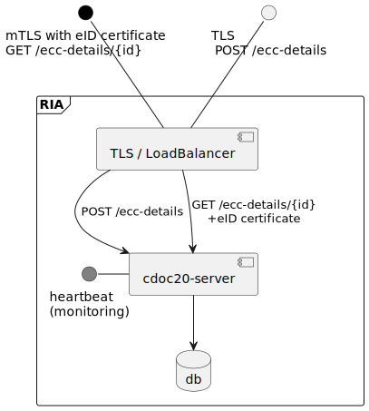

Info in this document will be moved to cdoc2 docs repo or removed.

## Deployment
possible deployment

## Used technologies

* Maven 3.8.x
* Java 17
* Spring Boot
* [FlatBuffers](https://google.github.io/flatbuffers/)
* OpenAPI generator [client](https://openapi-generator.tech/docs/generators/java), [spring](https://openapi-generator.tech/docs/generators/spring)
* [Bouncy Castle Crypto](https://www.bouncycastle.org/)
* [Apache Commons Compress](https://commons.apache.org/proper/commons-compress/)
* [PostgreSQL](https://www.postgresql.org/)
* [picocli](https://picocli.info/)
* [SLF4J](https://www.slf4j.org/)

